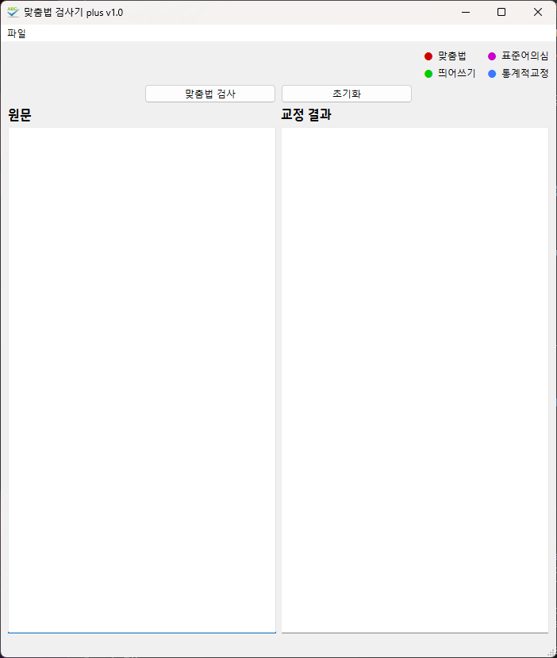

# 맞춤법 검사기 plus


맞춤법 검사기 plus는 네이버 맞춤법 검사기를 이용한 파이썬 기반의 한글 맞춤법 검사기입니다.



<br>

## **※ 특징**
500자 이상의 문장도 검사 가능
<br><br>

## **변경내역**
- v1.0: 첫 버전 릴리즈

## Pyinstaller를 이용한 직접 빌드
### **Requirements**
다음 명령어를 통해 필요한 라이브러리를 내려받습니다.
```
pip install - r requirements.txt
```

### **exe 빌드**
```
pyinstaller --noconsole --onefile --icon=icon.ico --name=Spell_Checker_plus_v1.0 spell_checker_plus.py
```

### **exe 파일 확인**
.\dist 경로 안에 Spell_Checker_plus_v1.0.exe 생성됨
<br><br>
## 사용 안내
네이버 한글 맞춤법 검사기를 바탕으로 제작되었습니다.

모든 결과 및 데이터에 대한 저작권은 주식회사 네이버에 있으며, 상업적 사용 및 불법적인 활용에 대해서 개발자는 어떠한 책임도 지지 않습니다.
